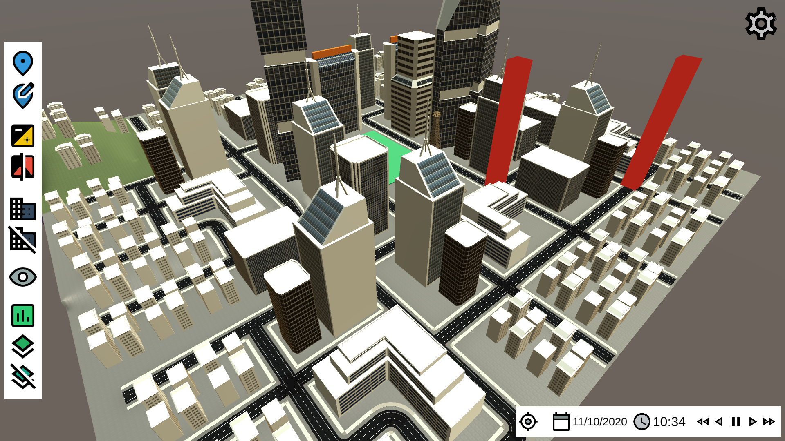
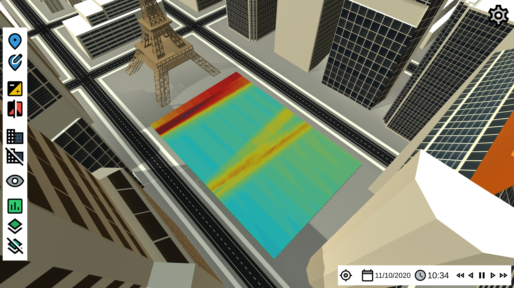
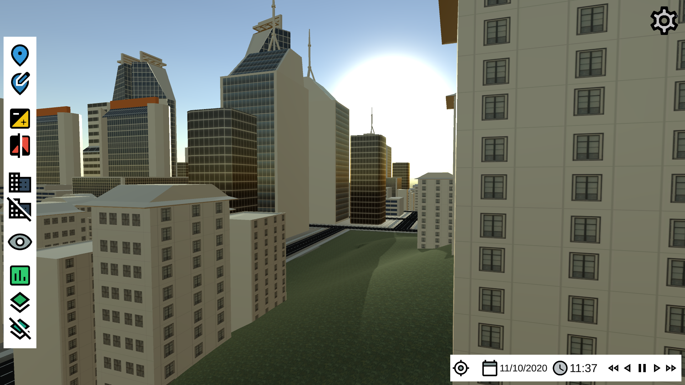

# On the Visualization of Spatiotemporal Urban Data

This repository is the source code of a city simulator running on the Unity engine. It has been developed as part as a project for the Computer Graphics course at NTNU i Ålesund. The simulator (available on Linux, Windows, MacOS and HTML) can be found on [itch.io](https://rylern.itch.io/city-simulator).

## Screenshots

## Features
* The scene represents a city including buildings of different shapes, a landmark, and a rectangular park. It is possible to move freely in the scene.
* The insertion and deletion of buildings is supported.
* The user has the ability to set the location and the date of the city. It defines the movement of the sun.
* A building is considered as a landmark. The simulator is able to display from which buildings the landmark can be seen.
* The shadow variation (amount of light over one day) and the [Change Frequency Heatmap](https://ieeexplore.ieee.org/document/8109149) on the park can be computed.
* The sky exposure (amount of sky that can be seen) can be computed at any point of the scene.
* The light intensity variation on different points of the city can be visualized with vertical bars whose height and color change depending on the illumination.
* The user can save, load and delete existing scenes.

## Resources used
* The [Unity engine](https://unity.com).
* The asset [White City](https://assetstore.unity.com/packages/3d/environments/urban/white-city-76766) for the buildings (which was free at the time of development).
* A concrete texture from the asset [Yughues Free Concrete Materials](https://assetstore.unity.com/packages/2d/textures-materials/concrete/yughues-free-concrete-materials-12951).
* A grass texture from the asset [Stylized Grass Texture](https://assetstore.unity.com/packages/2d/textures-materials/glass/stylized-grass-texture-153153).
* Icons from [material.io](https://material.io/resources/icons/).
* A [C# class](http://guideving.blogspot.com/2010/08/sun-position-in-c.html) giving the sun position given the location and the date.
